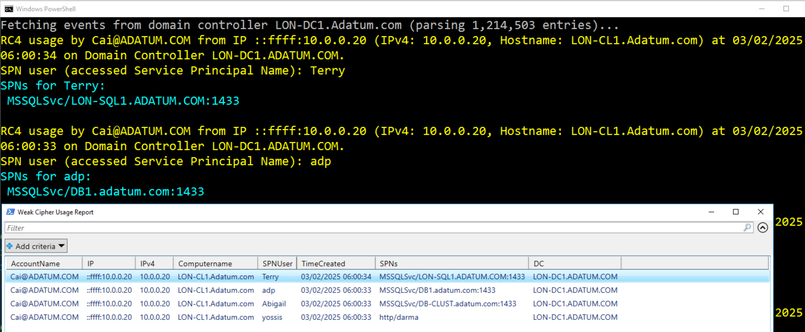

#### NOTE: This script will not be updated further. instead, can use -> 
<strong><a title="Get-KerberosServiceTicketAudit" href="https://github.com/YossiSassi/Get-KerberosServiceTicketAudit" target="_blank">Get-KerberosServiceTicketAudit</a> - </strong>Helps to assess Kerberos Cipher and Hash usage in Active Directory environments (e.g. Weak/Deprecated encryption types, or Quantum-resilient candidates).
 ###
 
Gets weak cipher usage (RC4 usage in Active Directory Domain environments). 
Useful for On-Prem diagnostics, overall attack surface analysis and/or preparation for Server 2025 AD upgrade (by default disables RC4 tickets). Similar to MDI (cloud app sec) weak cipher usage.

##### Can be useful to assess if can move to AES only (see which systems still use RC4), as well as indication for potential Kerberoasting attack (with False Positives, since systems may generate downgrade TGS regardless of this attack). #####
  

  
By default, queries all Domain Controllers' Security events logs (requires Event Log Readers or equivalent/DA).
  
OPTIONAL: Can limit events from X ago onwards (optional parameter), for shorter execution and avoid query overload in large environments/large Security Logs.
  
OPTIONAL: If using an Event Forwarder to log 4769 (Kerberos TGS events) from all DCs - can also specify an Event Forwarding server.
